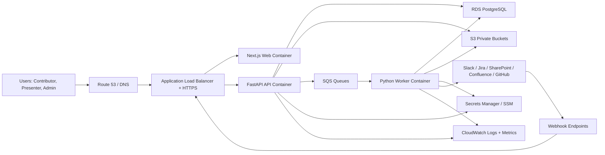
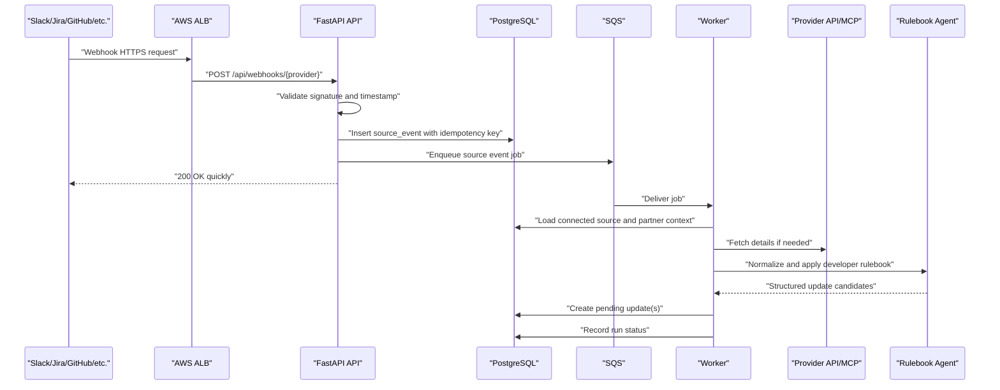
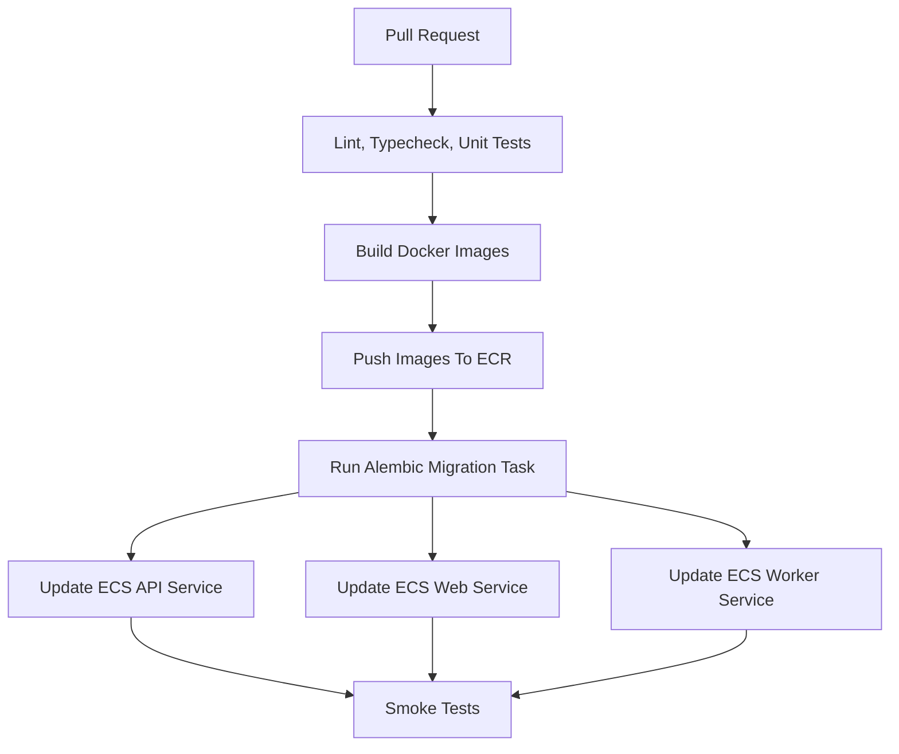

# AWS Deployment And Runtime Architecture

Product: Cloud AI Software Ecosystem Updates
Version: Draft v1
Date: 2026-08-07
Related documents:

- `docs/product_requirements_document.md`
- `docs/solution_architecture_tech_stack.md`
- `docs/sequential_feature_build_plan.md`
- `docs/current_project_reuse_assessment.md`
- `docs/ui_reuse_gap_assessment.md`
- `docs/aws_production_migration.md`

## 1. Purpose

This document explains how the new product-shaped build should run on AWS.

It is written for a DevOps engineer, solution architect, platform owner, or
technical reviewer who asks:

- What are the deployable components?
- Can this be containerized?
- Can this run on EC2?
- What should run in ECS/Fargate instead?
- What AWS services are required?
- Where does state live?
- Where do secrets live?
- How do Slack, Jira, SharePoint, Confluence, and GitHub integrations enter the
  system?
- How does the backend stay modular and production-shaped?
- What infrastructure is needed as each backend feature is built?

This document is not an implementation file and does not change the current
project. It is the target runtime architecture for the fresh rebuild.

## 2. Naming Standard

Canonical app name:

- `Cloud AI Software Ecosystem Updates`

Use this exact display name in:

- Login and landing screens.
- Browser/page titles.
- Admin-visible application labels.
- Technical architecture diagrams.
- PRD, architecture, deployment, and runbook documents.

Technical slug:

- `cloud-ai-software-ecosystem-updates`

Use this slug for:

- Repository/folder name.
- Container image names.
- ECS service names where length allows.
- CloudWatch log group prefixes.
- S3 bucket or prefix names where length allows.
- CI/CD job labels.

API title:

- `Cloud AI Software Ecosystem Updates API`

Server process names:

- `cloud-ai-software-ecosystem-updates-api`
- `cloud-ai-software-ecosystem-updates-worker`
- `cloud-ai-software-ecosystem-updates-migrations`

Client process name:

- `cloud-ai-software-ecosystem-updates-web`

If an AWS resource has a strict length limit, use a shorter infrastructure alias
such as `cloud-ai-ecosystem-updates`, but keep the user-facing product name as
`Cloud AI Software Ecosystem Updates`.

## 3. Executive Summary

The target product should be deployed as a modular monolith with separate
runtime processes:

```text
Client web app
  Next.js / React / TypeScript

API service
  FastAPI / Python

Worker service
  Python worker using the same backend codebase

Database
  PostgreSQL on RDS or Aurora PostgreSQL

Queue
  SQS queues with dead-letter queues

Object storage
  S3 buckets for files, generated artifacts, and source payload copies

Secrets
  AWS Secrets Manager and/or SSM Parameter Store

Container registry
  ECR

Runtime
  Recommended: ECS Fargate
  Acceptable EC2 path: ECS on EC2 or Docker containers on EC2 behind ALB
```

The recommended AWS runtime is ECS Fargate, not a hand-managed EC2 instance,
because the product has more than one process type: web, API, worker, migration,
and future scheduled jobs. Fargate gives clean separation without turning the
team into server administrators.

If a reviewer specifically asks whether the components can be deployed to EC2:
yes. Each runtime component can be containerized and deployed on EC2. However,
for a production-shaped architecture, EC2 should still run containers behind an
Application Load Balancer, use RDS for PostgreSQL, S3 for files, SQS for queues,
Secrets Manager for secrets, and CloudWatch for logs. EC2 should not mean
"everything on one box with local disk and local SQLite."

## 4. Target AWS Architecture



The core rule:

```text
HTTP requests should validate input, enforce authorization, write durable state,
enqueue background work, and return quickly.

Workers should perform slow integration calls, document parsing, extraction
agents, report generation, and memory updates.
```

## 5. Deployable Components

### 4.1 Web App Container

Name:

- `cloud-ai-software-ecosystem-updates-web`

Technology:

- Next.js
- React
- TypeScript

Responsibilities:

- Login and landing UI.
- Contributor View.
- Presenter View.
- Admin View.
- Role-aware account menu.
- Calls only the API service.
- Does not call Slack, Jira, SharePoint, Confluence, or GitHub directly.
- Does not store secrets.
- Does not own business rules.

AWS runtime:

- ECS Fargate service or EC2 container.
- Behind ALB.
- Public HTTPS endpoint.

Scaling:

- Horizontal scaling is safe because web app state should be held in cookies,
  server sessions, or API/database state, not local memory.

### 4.2 API Container

Name:

- `cloud-ai-software-ecosystem-updates-api`

Technology:

- FastAPI
- Python 3.12
- SQLAlchemy 2.x
- Alembic
- Pydantic v2

Responsibilities:

- Auth and sessions.
- Role and permission enforcement.
- User and partner administration.
- Partner metadata.
- Resource links.
- Pending and approved update lifecycle.
- Connected source lifecycle.
- Global integration configuration.
- Admin connected source approvals.
- Webhook receiving and signature validation.
- Job enqueueing.
- Presenter read APIs.
- Report generation requests.

AWS runtime:

- ECS Fargate service or EC2 container.
- Behind ALB.
- Exposes `/healthz` or `/api/health`.

Scaling:

- Horizontally scalable.
- Must not run singleton schedulers inside each API container.
- Uses RDS/SQS/S3 for shared state.

### 4.3 Worker Container

Name:

- `cloud-ai-software-ecosystem-updates-worker`

Technology:

- Python 3.12
- Same backend codebase as API
- Separate entrypoint such as `python -m app.workers.main`

Responsibilities:

- Consume SQS source events.
- Fetch external source details.
- Run source-specific normalizers.
- Apply developer-owned rulebooks.
- Create pending updates.
- Generate executive email drafts.
- Generate future Word artifacts.
- Update partner memory.
- Record failures and retries.

AWS runtime:

- ECS Fargate service or EC2 container.
- No public inbound traffic.
- Private subnets preferred.

Scaling:

- Can run multiple worker tasks if idempotency is implemented.
- Must use queue visibility timeouts, retry limits, and dead-letter queues.

### 4.4 Database Migration Task

Name:

- `cloud-ai-software-ecosystem-updates-migrations`

Technology:

- Alembic inside the API image.

Responsibilities:

- Apply schema changes before API/worker release.
- Fail deployment if schema migration fails.

AWS runtime:

- One-off ECS task.
- CI/CD pipeline step before service rollout.

Rule:

- Never rely on application startup to silently create production tables.
- Production schema changes must be explicit migrations.

### 4.5 Optional Scheduled Job Trigger

Default:

- No polling fallback for integrations where webhooks are available.

Allowed scheduled jobs:

- Maintenance tasks.
- Report regeneration jobs.
- Retry cleanup.
- Memory refresh if explicitly required later.
- Manual backfill jobs triggered by Admin or operator action.

AWS runtime:

- EventBridge Scheduler to SQS or one-off ECS task.

Rule:

- Do not add automatic polling as the normal integration path if a webhook path
  exists and is working.

## 6. Recommended AWS Services

| Need | AWS Service | Why |
| --- | --- | --- |
| Container runtime | ECS Fargate | Clean separation of web/API/worker without managing servers. |
| EC2-compatible runtime | ECS on EC2 or Docker on EC2 | Possible if platform requires EC2, but more operational work. |
| Container images | ECR | Standard AWS image registry. |
| HTTPS entrypoint | Application Load Balancer | Routes web, API, and webhooks over TLS. |
| DNS | Route 53 | Domain routing if AWS owns DNS. |
| TLS cert | ACM | Managed certificate for HTTPS. |
| Relational state | RDS PostgreSQL or Aurora PostgreSQL | Durable source of truth. |
| Files/artifacts | S3 | Uploaded files, source file copies, generated reports. |
| Async jobs | SQS + DLQ | Reliable worker decoupling and retries. |
| Secrets | Secrets Manager and/or SSM Parameter Store | Runtime secrets outside git and DB. |
| Logs/metrics | CloudWatch | App logs, alarms, dashboards. |
| Network isolation | VPC, subnets, security groups | DB and worker should not be public. |
| Encryption keys | KMS | S3/RDS/secrets encryption control. |
| Edge protection | WAF | Optional, useful before wider rollout. |
| CI/CD identity | IAM OIDC for GitHub Actions or CI role | Deploy without long-lived AWS access keys. |

## 7. ECS Fargate Versus EC2 Decision

### Recommended Path: ECS Fargate

Use Fargate for the fresh rebuild unless ARM/platform constraints force EC2.

Reasons:

- No server patching.
- Clean web/API/worker separation.
- Easier horizontal scaling.
- Easier task replacement.
- Better fit for one API service plus one or more workers.
- Less risk of accidental local-disk dependencies.

Target services:

```text
ECS cluster
  service: web
  service: api
  service: worker-source-events
  optional service: worker-report-generation
  one-off task: migrations
```

### Acceptable Path: ECS On EC2

If the technical/platform team requires EC2 capacity:

```text
Application Load Balancer
  -> ECS service on EC2: web
  -> ECS service on EC2: api

Private EC2 container instances
  -> ECS task: worker
  -> ECS task: migrations

Shared AWS services
  -> RDS PostgreSQL
  -> S3
  -> SQS
  -> Secrets Manager
  -> CloudWatch
```

This still keeps the architecture production-shaped. EC2 becomes the compute
substrate, not the architecture.

### Pilot-Only Path: Single EC2 With Docker Compose

This can be used only as a short-lived internal pilot:

```text
Single EC2 instance
  docker compose service: web
  docker compose service: api
  docker compose service: worker

External managed services
  RDS PostgreSQL
  S3
  SQS
  Secrets Manager
```

This is not the recommended long-term target because:

- Single instance is a single point of failure.
- Deployments are more manual.
- Scaling is harder.
- Security patching becomes an application-team responsibility.
- Worker and API contention can become messy.

If used, it must be treated as transitional.

## 8. Network Topology

Recommended layout:

```text
VPC
  Public subnets
    Application Load Balancer

  Private app subnets
    ECS tasks: web, api, worker

  Private data subnets
    RDS PostgreSQL

  VPC endpoints where useful
    S3
    ECR
    CloudWatch Logs
    Secrets Manager
    SQS
```

Security group rules:

| Source | Destination | Port | Purpose |
| --- | --- | ---: | --- |
| Internet or corporate ingress | ALB | 443 | User and webhook HTTPS traffic. |
| ALB SG | Web task SG | 3000 | Web container traffic. |
| ALB SG | API task SG | 8000 | API and webhook traffic. |
| Web task SG | API task SG | 8000 | Server API calls if web calls API internally. |
| API task SG | RDS SG | 5432 | Database access. |
| Worker task SG | RDS SG | 5432 | Database access. |
| API/worker task SG | External internet or proxy | 443 | Slack/Jira/Graph/Confluence/GitHub calls. |
| API/worker task SG | AWS services | 443 | S3/SQS/Secrets/CloudWatch. |

Production preference:

- RDS in private subnets.
- Worker in private subnets.
- API and web tasks can be in private subnets behind ALB if NAT/VPC endpoints
  are available.
- ALB is the only public inbound component.

Open platform question:

- Are Jira, Confluence, SharePoint, and Slack reachable from AWS public egress,
  or does ARM require VPN, Direct Connect, private proxy, or IP allowlisting?

This must be clarified before integration cutover.

## 9. Data Stores

### 8.1 PostgreSQL

Use RDS PostgreSQL or Aurora PostgreSQL as the primary source of truth.

Stored in PostgreSQL:

- Users.
- Role assignments.
- Sessions.
- Partners.
- Partner assignments.
- Partner metadata snapshots.
- Resource links.
- Global integrations.
- Integration secret metadata.
- Connected sources.
- Source event records.
- Pending and approved updates.
- Report artifact metadata.
- Partner memory records.
- Audit records.

Important production rules:

- No SQLite in deployed environments.
- No local filesystem for durable product data.
- Alembic migrations own schema changes.
- UUID primary keys for product entities.
- Foreign keys for all real relationships.
- JSONB only for provider-specific metadata or raw payload references, not core
  business state.

Backups:

- Enable automated RDS backups.
- Define retention period.
- Enable point-in-time recovery for production.
- Enable deletion protection for production.
- Test restore before broader rollout.

### 8.2 S3

Use private S3 buckets for durable file and artifact storage.

Suggested buckets or prefixes:

```text
s3://cloud-ai-software-ecosystem-updates-<env>/
  uploads/
    admin-knowledge/
    contributor-files/

  source-copies/
    sharepoint/
    confluence/
    github/

  source-payloads/
    slack/
    jira/
    sharepoint/
    confluence/
    github/

  artifacts/
    executive-email/
    monthly-word/
    decision-board/

  temp/
```

Rules:

- Buckets private by default.
- Server-side encryption enabled.
- Object versioning enabled for production where useful.
- Lifecycle rules for temporary data.
- Signed URLs only for controlled downloads.
- Database stores metadata and S3 keys, not large files.

### 8.3 SQS

Use queues to decouple web requests from slow processing.

Recommended queues:

```text
source-events
source-events-dlq

report-jobs
report-jobs-dlq

memory-jobs
memory-jobs-dlq
```

Rules:

- API receives webhooks and enqueues.
- Worker consumes and processes.
- Failed jobs retry.
- Exhausted jobs move to DLQ.
- DLQ alarms must page or alert the maintainer.

## 10. Integration Runtime Model

The product separates two types of configuration:

### 9.1 Global Integration Configuration

Owned by:

- Admin and/or developer/operator.

Stored in:

- `integrations` table for visible status.
- Secrets Manager or encrypted `integration_secrets` for sensitive values.

Examples:

- Slack signing secret.
- Slack bot token.
- Jira base URL.
- Jira webhook secret.
- Jira service account token or MCP auth material.
- Microsoft Graph tenant/client credentials.
- Confluence base URL and token.
- GitHub webhook secret.
- GitHub App credentials or PAT.

Shown in UI:

- Configured/not configured.
- Enabled/disabled.
- Last tested status.
- Webhook URL.
- Recent health summary.

Not shown in UI:

- Actual saved secret values.

### 9.2 Contributor Connected Source Configuration

Owned by:

- Contributor, for assigned partners only.

Stored in:

- `connected_sources` and type-specific child tables.

Examples:

- Slack channel ID and bot-invited confirmation.
- Jira single issue URL.
- SharePoint single file URL.
- Confluence single page URL.
- GitHub repo/issue/PR URL.

Shown in UI:

- Source display name.
- Source type.
- Source URL where applicable.
- Status.
- Last tested summary.
- Admin approval result.

Not shown in UI:

- Global secrets.
- Raw source excerpts.
- Technical event payloads.

### 9.3 Admin Connected Source Approval

Owned by:

- Admin.

Flow:

```text
Contributor requests source
  -> status = pending
Admin reviews request
  -> access test runs
  -> admin approves, rejects, or marks needs access setup
If approved
  -> status = active
  -> source events can create pending updates
If rejected
  -> contributor sees rejected status
If needs access setup
  -> contributor sees action-needed status
```

Rules:

- Exact duplicates can be rejected or flagged instantly.
- Near duplicates remain broad and visible so contributor/admin can decide.
- Approval requires global integration to be configured and enabled.
- Approval requires source-specific access test to pass unless Admin explicitly
  marks it as needs access setup.

## 11. Webhook And Worker Flow



Provider-specific notes:

| Provider | Inbound model | Processing rule |
| --- | --- | --- |
| Slack | Events API webhook | Process messages and thread replies for active mapped channel. |
| Jira | Webhook for issue/comment/status events | Single issue source only for v1; fetch full issue details via REST/MCP. |
| SharePoint | File event/webhook or approved source job | Single file source only; use Graph and rulebook context. |
| Confluence | Page event/webhook where available | Single page source only; use page URL/source identity. |
| GitHub | Webhook | Repo/issue/PR source scopes respected. |

No polling fallback should be introduced as the normal path where webhooks are
available and configured.

Manual backfill may exist later as an operator/admin-triggered job, but it is
not a product polling loop.

## 12. Authentication And Authorization Runtime

### 11.1 V1 Local Auth

The first rebuild supports local email/password login until ARM SSO is ready.

Rules:

- Admin creates users.
- Users log in with email and password.
- No self-service signup.
- No forgot-password UI.
- No OTP route.
- Admin UI does not show password fields for v1 unless later promoted.
- Password hashes stored securely.
- Session cookies must use secure production settings behind HTTPS.

Minimum production hardening:

- Password hashing.
- Secure cookie flags.
- CSRF protection for state-changing browser requests.
- Login rate limiting.
- Failed login audit records.
- Deactivated user blocking.
- Stable application secret across all API tasks.

### 11.2 Future ARM SSO

The auth boundary should be designed so local auth can be replaced by ARM SSO.

Future target:

- OIDC/SAML based SSO.
- Email from SSO maps to `users.email`.
- Roles still managed in app by Admin unless ARM group mapping is later added.
- Local password login can be disabled.

Open SSO decisions:

- Who is the first bootstrap admin?
- Are Admin/Contributor/Presenter roles managed inside the app or mapped from
  ARM identity groups?
- Will ARM require an internal-only network or enterprise app registration?

## 13. Security Model

### 12.1 Secrets

Secrets must not be stored in:

- Git.
- Local `.env` committed to repo.
- CloudWatch log output.
- Frontend code.
- Contributor source records.
- Resource links.

Secrets may be stored in:

- AWS Secrets Manager.
- SSM Parameter Store for non-secret config.
- Encrypted `integration_secrets` table if Admin UI needs to save and rotate
  integration credentials.

Recommended split:

```text
Secrets Manager
  DATABASE_URL or DB credentials
  APP_SECRET_KEY
  Slack bot token
  Slack signing secret
  Jira token/webhook secret
  Microsoft Graph credentials
  Confluence token
  GitHub webhook secret/App key
  AI provider/API credentials

SSM Parameter Store
  APP_ENV
  APP_BASE_URL
  CORS origins
  feature flags
  bucket names
  queue URLs
```

### 12.2 Database Security

Rules:

- RDS not public.
- Only API and worker security groups can access RDS.
- Encryption at rest enabled.
- Automated backups enabled.
- Separate users/credentials by environment.
- Application role should not have superuser privileges.

### 12.3 S3 Security

Rules:

- Private buckets.
- Block public access.
- Encryption at rest.
- IAM policies limited by bucket and prefix.
- Signed download URLs expire quickly.
- Lifecycle rules for temporary generated artifacts.

### 12.4 App Authorization

Contributor:

- Can view and edit only assigned partners in Contributor View.
- Can request connected sources for assigned partners.
- Can approve/edit/dismiss pending updates for assigned partners.
- Can view Presenter View if they also have Presenter role.

Presenter:

- Read-only view across all partners.
- Can view approved updates.
- Can view partner metadata only when a single partner is selected.
- Can generate/read draft email and analysis outputs.
- Cannot edit reports or updates in v1.

Admin:

- Manages users.
- Manages roles.
- Manages partners and assignments.
- Configures global integrations.
- Approves/rejects connected source requests.
- Does not need rulebook editing UI in v1.

## 14. Observability

### 13.1 Logs

Use structured logs for:

- Request ID.
- User ID where authenticated.
- Partner ID where applicable.
- Connected source ID where applicable.
- Provider type.
- Source event ID.
- Job ID.
- Error type.

Log destinations:

- CloudWatch Log Group per service:
  - `/cloud-ai-software-ecosystem-updates/<env>/web`
  - `/cloud-ai-software-ecosystem-updates/<env>/api`
  - `/cloud-ai-software-ecosystem-updates/<env>/worker`
  - `/cloud-ai-software-ecosystem-updates/<env>/migrations`

Do not log:

- Tokens.
- Passwords.
- Signing secrets.
- Full raw Slack/Jira/SharePoint payloads unless explicitly redacted and stored
  in controlled S3/debug storage.

### 13.2 Metrics And Alarms

Minimum alarms:

| Alarm | Why |
| --- | --- |
| ALB 5xx rate | Detect API/web outage. |
| API task unhealthy | Detect runtime failure. |
| Worker task unhealthy | Detect ingestion/report failure. |
| SQS queue age too high | Detect stuck processing. |
| DLQ visible messages > 0 | Detect failed jobs needing attention. |
| RDS CPU/storage/free connections | Detect database pressure. |
| RDS backup failure | Protect recovery posture. |
| Webhook signature failures spike | Detect misconfiguration or attack. |
| Integration access test failures | Detect broken Slack/Jira/etc. config. |

### 13.3 Admin Health UI

Dedicated Admin Health/Audit UI is backlog, but backend records should be
created from the start.

The system should store:

- Integration test runs.
- Source event statuses.
- Worker job statuses.
- Connected source approval actions.
- Failed webhook attempts summary.
- User login audit records.

## 15. CI/CD Pipeline

Recommended source:

- GitHub Actions, GitLab CI, or ARM-approved CI.

Recommended deployment flow:



Pipeline stages:

1. Install dependencies.
2. Run frontend lint/typecheck/tests.
3. Run backend lint/tests.
4. Build Docker images.
5. Push images to ECR with immutable tag.
6. Run database migration task.
7. Update ECS services.
8. Run smoke tests:
   - health endpoint
   - login
   - contributor dashboard
   - admin dashboard
   - presenter dashboard
9. Stop deployment if smoke tests fail.

Infrastructure as code:

- Use Terraform or AWS CDK.
- Do not create long-term infrastructure manually in the console.

Environments:

```text
local
  Developer machine with Docker Compose.

dev or staging
  AWS environment for integration testing, if account access allows.

prod pilot
  Guarded production deployment for limited internal users.

prod
  Wider production after SSO, monitoring, backups, and access reviews.
```

## 16. Local Development Runtime

Use Docker Compose for local development.

Recommended services:

```text
postgres
api
worker
web
localstack optional
mailpit optional
```

Local development should mirror production boundaries:

- API and worker are separate processes.
- PostgreSQL is used locally, not SQLite.
- S3 can be abstracted through local filesystem or LocalStack.
- SQS can be abstracted through in-memory/local queue for development, but the
  interface should match production.

This prevents the fresh build from repeating the prototype problem where local
shortcuts become hidden production assumptions.

## 17. Environment Variables And Runtime Configuration

### 16.1 Core App Configuration

```env
APP_ENV=local|dev|staging|production
APP_BASE_URL=https://cloud-ai-software-ecosystem-updates.example.com
API_BASE_URL=https://cloud-ai-software-ecosystem-updates.example.com/api
APP_SECRET_KEY=<from-secret-store>
AUTH_MODE=local|sso
LOG_LEVEL=INFO
CORS_ORIGINS=https://cloud-ai-software-ecosystem-updates.example.com
```

### 16.2 Database

```env
DATABASE_URL=<from-secret-store>
DB_POOL_SIZE=10
DB_MAX_OVERFLOW=20
```

### 16.3 AWS

```env
AWS_REGION=us-east-1
S3_BUCKET=cloud-ai-software-ecosystem-updates-production
SQS_SOURCE_EVENTS_QUEUE_URL=<queue-url>
SQS_REPORT_JOBS_QUEUE_URL=<queue-url>
SQS_MEMORY_JOBS_QUEUE_URL=<queue-url>
```

### 16.4 Auth And Session

```env
SESSION_COOKIE_NAME=partner_intelligence_session
SESSION_TTL_DAYS=30
ALLOW_LOCAL_AUTH_IN_PROD=true
```

`ALLOW_LOCAL_AUTH_IN_PROD=true` should be temporary and revisited when ARM SSO
is available.

### 16.5 AI And Rulebook Runtime

```env
AI_PROVIDER=<provider>
AI_MODEL_UPDATE_EXTRACTION=<model>
AI_MODEL_REPORTING=<model>
AI_API_KEY=<from-secret-store>
RULEBOOK_DIR=app/agents/rulebooks
```

Rulebooks are developer-owned in v1. They should live in source control as
reviewable files, not as editable Admin UI content.

### 16.6 Integration Secrets

Examples:

```env
SLACK_SIGNING_SECRET=<from-secret-store>
SLACK_BOT_TOKEN=<from-secret-store>

JIRA_BASE_URL=https://jira.example.com
JIRA_WEBHOOK_SECRET=<from-secret-store>
JIRA_SERVICE_TOKEN=<from-secret-store>

MICROSOFT_TENANT_ID=<from-secret-store>
MICROSOFT_CLIENT_ID=<from-secret-store>
MICROSOFT_CLIENT_SECRET=<from-secret-store>

CONFLUENCE_BASE_URL=https://confluence.example.com
CONFLUENCE_TOKEN=<from-secret-store>

GITHUB_WEBHOOK_SECRET=<from-secret-store>
GITHUB_APP_ID=<from-secret-store>
GITHUB_PRIVATE_KEY=<from-secret-store>
```

Contributor-specific values such as Slack channel ID, Jira issue URL, and
SharePoint file URL do not belong in environment variables. They belong in the
database as connected source configuration.

## 18. Feature-To-Infrastructure Mapping

| Feature | Infrastructure Needed |
| --- | --- |
| 01 Fresh Project Foundation | Local Docker Compose, API container, web container, PostgreSQL, Alembic, health endpoint. |
| 02 Auth, Sessions, Local Login | PostgreSQL users/sessions, app secret, secure cookies, API service. |
| 03 Role Model And Switcher | PostgreSQL roles, permission middleware, web/API routing. |
| 04 Admin Team / Users | API, PostgreSQL, audit records. |
| 05 Admin Partners / Assignments | API, PostgreSQL, audit records. |
| 06 Contributor Partner Selection | API, PostgreSQL indexes for assignments and activity. |
| 07 Contributor Dashboard Shell | API aggregation endpoints, PostgreSQL. |
| 08 Metadata And Resource Library | PostgreSQL metadata/resource tables, S3 only for future file-linked artifacts. |
| 09 Pending/Approved Updates | PostgreSQL updates table, indexes by partner/cycle/status. |
| 10 Manual Add Update | API and PostgreSQL only. |
| 11 File/Knowledge Upload | S3 bucket, upload metadata tables, parser worker if processing is async. |
| 12 Contributor Connected Sources | PostgreSQL connected source tables, API, status/audit records. |
| 13 Admin Global Integrations | Secrets Manager/SSM, encrypted integration secrets, integration test runs. |
| 14 Admin Connected Source Approvals | API, PostgreSQL approvals, worker-access test jobs optional. |
| 15 Source Event Queue And Worker | SQS, DLQ, worker ECS service, source event tables, CloudWatch alarms. |
| 16 Slack Processing | Public HTTPS webhook endpoint, Slack secrets, SQS, worker, CloudWatch. |
| 17 Jira Processing | Public HTTPS webhook endpoint, Jira secrets/MCP auth, SQS, worker, outbound network access. |
| 18 SharePoint Processing | Microsoft Graph credentials, S3 source file copies, worker, outbound network access. |
| 19 Confluence Processing | Confluence credentials/MCP connector, worker, outbound network access. |
| 20 GitHub Processing | GitHub webhook secret/App credentials, SQS, worker, outbound network access. |
| 21 Presenter Intelligence + Draft Email | API, worker for generation if async, S3 for artifacts, AI secrets, report tables. |

## 19. Deployment Phases

### Phase 0: Local Product Foundation

Goal:

- Prove the fresh app runs locally with production-shaped boundaries.

Includes:

- Docker Compose.
- PostgreSQL.
- Web container.
- API container.
- Worker container.
- Alembic migrations.
- Health checks.

Exit criteria:

- Local login works.
- User/partner/metadata/update flows work.
- API and worker are separate processes.

### Phase 1: AWS Skeleton

Goal:

- Create AWS runtime foundation before integration complexity.

Includes:

- VPC/subnet decision.
- ECR repositories.
- ECS cluster.
- ALB.
- ACM certificate.
- RDS PostgreSQL.
- S3 bucket.
- SQS queues and DLQs.
- Secrets Manager entries.
- CloudWatch log groups.

Exit criteria:

- API `/healthz` works over HTTPS.
- Web app loads over HTTPS.
- Migration task can reach RDS.

### Phase 2: Core Product Deploy

Goal:

- Deploy user/partner/metadata/update lifecycle without external integrations.

Includes:

- Features 02-11.
- Local auth.
- Admin users/partners.
- Contributor metadata.
- Pending/approved updates.
- Manual add update.
- File/knowledge upload if included.

Exit criteria:

- Admin can configure users and partners.
- Contributor can save metadata.
- Contributor can approve manual pending updates.
- Presenter can read approved updates.

### Phase 3: Connected Source Control Plane

Goal:

- Add global integration config and contributor source requests.

Includes:

- Features 12-14.
- Admin integration UI.
- Contributor connected source UI.
- Admin approval UI.
- Source-specific access tests.

Exit criteria:

- Contributor can request a Jira/Slack/SharePoint/Confluence/GitHub source.
- Admin can test and approve/reject.
- Contributor sees resulting status.

### Phase 4: Event Processing Runtime

Goal:

- Turn approved sources into pending updates through the worker pipeline.

Includes:

- Feature 15.
- SQS source queue and DLQ.
- Worker service.
- Event idempotency.
- Agent run logging.
- CloudWatch alarms.

Exit criteria:

- Test event produces one pending update.
- Duplicate event does not duplicate pending update.
- Failed event is visible and retryable.

### Phase 5: Provider Cutovers

Goal:

- Enable one provider at a time.

Recommended order:

1. Slack.
2. Jira.
3. SharePoint.
4. Confluence.
5. GitHub.

Reason:

- Slack and Jira are the most immediate collaboration/update sources.
- SharePoint/Confluence/GitHub can be added after the core ingestion path is
  proven.

Exit criteria per provider:

- Webhook or source trigger reaches production HTTPS endpoint.
- Signature/auth verification works.
- Worker fetches provider details.
- Rulebook creates pending updates.
- Contributor approval flow works.
- Failures are observable.

### Phase 6: Presenter Intelligence And Email

Goal:

- Complete the presenter-facing intelligence workflow.

Includes:

- Feature 21.
- Approved update feed.
- Single-partner metadata read-only panel.
- Decision Board/Analysis View.
- Draft email generation.
- S3 artifact storage if generation creates downloads.

Exit criteria:

- Presenter can view all approved updates.
- Presenter can filter by month/partner.
- Presenter can generate analysis/email draft.
- No report editing UI is exposed.

### Phase 7: Hardening Before Wider Rollout

Goal:

- Make the deployment defensible beyond internal pilot.

Includes:

- SSO planning or implementation.
- Rate limiting.
- WAF if public.
- Backup/restore test.
- DLQ runbook.
- Integration failure runbook.
- RDS monitoring.
- Audit export or admin health backlog review.

Exit criteria:

- Technical reviewer can see clear runbooks, alarms, backups, and ownership.

## 20. Containerization Requirements

Recommended repository container files:

```text
apps/web/Dockerfile
apps/api/Dockerfile
docker-compose.yml
infra/
  terraform/ or cdk/
```

Recommended image strategy:

```text
ECR
  cloud-ai-software-ecosystem-updates-web:<git-sha>
  cloud-ai-software-ecosystem-updates-api:<git-sha>

ECS
  web uses web image
  api uses api image
  worker uses api image with worker command override
  migrations uses api image with alembic command override
```

The worker can reuse the API image if the backend codebase is packaged cleanly.
This reduces duplicate dependency drift.

Container rules:

- Containers are stateless.
- No durable writes to local disk.
- All durable state goes to RDS or S3.
- All secrets come from AWS runtime secret injection.
- Health checks exist for web and API.
- Worker exposes no public port.

## 21. Runbooks Required Before Pilot

Minimum runbooks:

1. Deploy new version.
2. Roll back API/web/worker.
3. Run database migration.
4. Restore database from backup.
5. Rotate app secret.
6. Rotate Slack/Jira/GitHub secrets.
7. Reprocess failed source event from DLQ.
8. Disable a broken connected source.
9. Disable a global integration.
10. Add bootstrap admin before SSO.
11. Test production webhook endpoint.
12. Review CloudWatch errors after deployment.

These runbooks can start as Markdown files in `docs/runbooks/`.

## 22. Technical Reviewer Approval Checklist

A DevOps/platform reviewer should be able to approve the plan if these answers
are clear:

- The app is split into client, API, worker, database, storage, queue, and
  secrets.
- Each runtime component can be containerized.
- The API and worker are separate processes.
- Long-running jobs do not run inside web requests.
- PostgreSQL is the production database, not SQLite.
- Files and artifacts live in S3, not local disk.
- Webhooks enter through HTTPS and are signature-verified.
- SQS decouples webhook receipt from processing.
- DLQs and alarms exist for failures.
- Secrets are not in git or frontend code.
- Contributor source configuration is separated from global integration
  credentials.
- Admin approval exists before contributor sources become active.
- IAM permissions are scoped to required buckets, queues, secrets, and logs.
- RDS is private and backed up.
- The architecture works on ECS Fargate and can be adapted to EC2 if required.
- CI/CD builds immutable images and runs migrations deliberately.
- Local development mirrors production boundaries.

## 23. Open Decisions

These need confirmation before final AWS implementation:

| Decision | Current Recommendation |
| --- | --- |
| ECS Fargate vs EC2 | Recommend ECS Fargate. EC2 acceptable only as managed container host or short pilot. |
| AWS account and region | Use ARM-approved account/region. Existing notes mention `us-east-1`, but confirm for rebuild. |
| Network access to Jira/Confluence | Confirm public egress, VPN, proxy, Direct Connect, or allowlist requirement. |
| Slack external partner permissions | Confirm whether the bot can be installed in partner/external channels. |
| SSO timing | Build local auth first, keep clean OIDC extension point. |
| Bootstrap admin | Decide initial admin provisioning method before SSO. |
| Email provider | Decide between Graph/Outlook, SMTP, or SES depending on ARM policy. |
| AI provider and model | Confirm approved provider, model, network route, and data policy. |
| File retention | Define retention for uploaded files, source copies, raw payloads, and generated artifacts. |
| Admin health UI | Backlog for UI, but backend audit records should exist from the start. |

## 24. Final Recommendation

Build the fresh product as:

```text
Next.js client
FastAPI API
Python worker
PostgreSQL
S3
SQS
Secrets Manager
ECS Fargate
CloudWatch
Terraform or CDK
```

This is the cleanest shape for the product described in the PRD and build plan.
It is modular enough to defend in a technical review, but not overcomplicated
into microservices.

If the organization insists on EC2, keep the same containers and managed AWS
state services. Do not collapse the architecture into a single mutable server.
