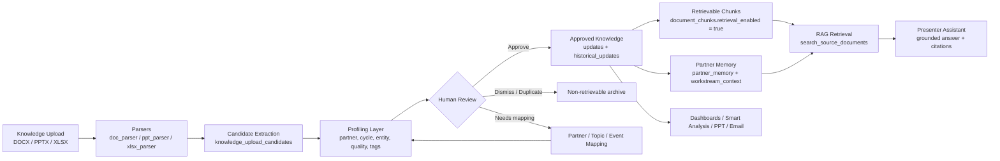
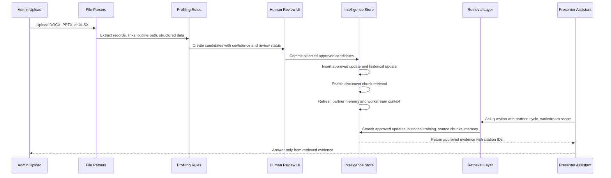
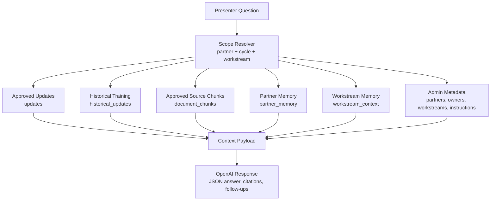
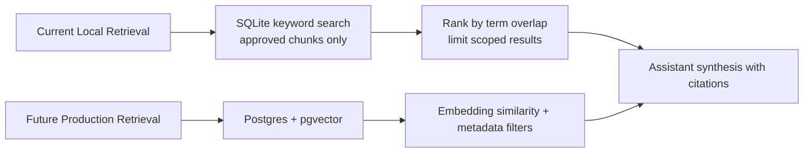

# Intelligence Layer And RAG Flow

This project's intelligence layer is a review-gated RAG system. Uploaded files
are parsed into candidate facts, profiled, reviewed by a human, and only then
enabled for retrieval by dashboards, smart analysis, and the presenter
assistant.

## 1. Simple Intelligence Layer Diagram

## 2. How RAG Works In This Project

## 3. Profiling Parameters

| Parameter | Meaning | Where It Is Used |
| --- | --- | --- |
| `partner_slot` | Configured partner identity such as Google, Microsoft, AWS, etc. | Access control, dashboards, update grouping, retrieval scope |
| `partner` | Human-readable partner name | Presenter views and generated content |
| `cycle` | Reporting period such as `Jul-2026` | Monthly/quarterly filtering and retrieval |
| `entity_type` | `partner`, `topic`, or `event` | Decides whether an item becomes software ecosystem intelligence or topic/event knowledge |
| `entity_key` | Stable key for the partner/topic/event | Mapping, dedupe, and entity memory |
| `section_label` | Source section/workstream label | Workstream grouping and context |
| `quality_score` | Heuristic score from 0 to 1 based on whether the text is actionable | Review triage |
| `partner_confidence` | Confidence that the candidate belongs to the identified partner | Review triage |
| `update_confidence` | Confidence that the text is a useful business update | Review triage and approved update confidence |
| `review_status` | `ready`, `needs_mapping`, `likely_noise`, `duplicate`, `approved`, or `dismissed` | Controls whether an item can be committed |
| `retrieval_enabled` | Boolean gate for whether a chunk can be retrieved by RAG | Prevents unapproved data from reaching the assistant |
| `embedding` | Stored vector representation of the text or memory summary | Prepared for semantic/vector retrieval |
| `links_json` | Source evidence links | Citations and provenance |
| `linked_evidence_json` | Parsed evidence from linked docs/pages | Richer source provenance |
| `structured_data_json` | Parser-specific structured facts from decks/trackers | Smart analysis and presenter summaries |
| `presenter_summary` | Human-approved presenter-friendly wording | Dashboard, assistant, email, and PPT outputs |

## 4. Retrieval Sources Used By The Presenter Assistant

The assistant is intentionally constrained: it must answer from supplied tool
data only, and it must not expose staged, dismissed, duplicate, or unapproved
records.

## 5. Current Versus Future Retrieval

Current implementation stores embeddings during upload/commit, but the local
retrieval path is SQLite-friendly keyword search over approved chunks. The
natural production upgrade is Postgres with `pgvector`, keeping the same
approval and metadata gates.

## 6. Suggested Presentation Narrative

1. We do not treat uploaded decks and trackers as trusted knowledge immediately.
2. The system parses each file into candidate facts with partner, cycle, entity,
   confidence, quality, links, and structured evidence.
3. A human review step decides what becomes approved intelligence.
4. Only approved intelligence becomes retrievable in the RAG layer.
5. The assistant and Smart Analysis use this curated layer to answer questions,
   produce cited summaries, and generate presenter-ready material.

